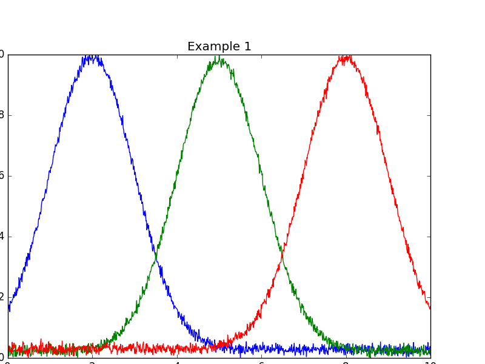
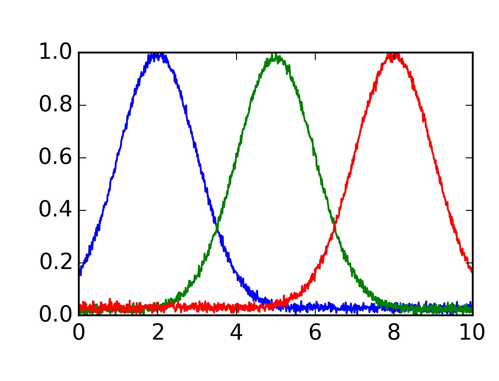
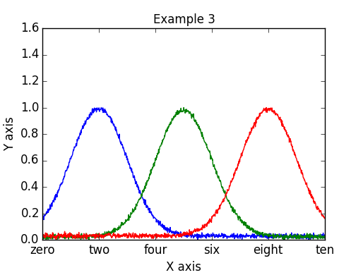
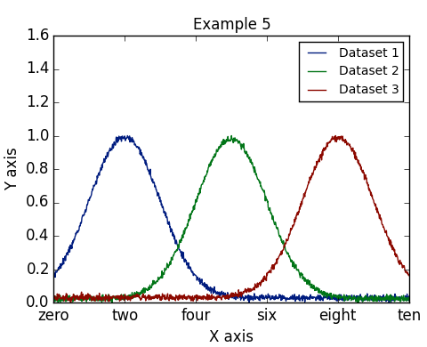

Getting Started
===============

Basic Usage
-----------

MYPlotSpec prepares matplotlib figures to specifications provided in a YAML
file. At the most basic level the YAML file may specify simply an outfile and
the dataset infiles to plot on it::

    figures:
        0:
            outfile:    examples/example_1.png
            subplots:
                0:
                    datasets:
                        0:
                            infile: examples/dataset_1.txt
                        1:
                            infile: examples/dataset_2.txt
                        2:
                            infile: examples/dataset_3.txt

The resulting plot uses matplotlib's rcParams (i.e. defaults) for all settings,
yielding a poorly-formatted figure. We could use matplotlib's functions to
adjust the formatting, but we will instead specify adjustments in the YAML
file, allowing MYPlotSpec to handle matplotlib for us.

Figure Settings
---------------

We may specify the margins and subplot dimensions of the figure::

    figures:
        ...
        1:
            outfile:    examples/example_2.png
            left:       0.6
            sub_width:  3.0
            right:      0.2
            bottom:     0.5
            sub_height: 2.0
            top:        0.4
            subplots:
                0:
                    datasets:
                        0:
                            infile: examples/dataset_1.txt
                        1:
                            infile: examples/dataset_2.txt
                        2:
                            infile: examples/dataset_3.txt

This yields a much better-proportioned figure.

Subplot Settings
----------------

We may further adjust the subplot formatting, adding a title and axis labels,
and applying specific formatting to the ticks::

    figures:
        ...
        2:
            outfile:    examples/example_3.png
            left:       0.6
            sub_width:  3.0
            right:      0.2
            bottom:     0.5
            sub_height: 2.0
            top:        0.4
            subplot_kw:
                autoscale_on: False
            subplots:
                0:
                    title:       Subplot Title
                    xlabel:      X Axis
                    ylabel:      Y Axis
                    xticks:      [0, 2, 4, 6, 8, 10]
                    xticklabels: ["zero", "two", "four", "six", "eight", "ten"]
                    yticks:      [0.0, 0.2, 0.4, 0.6, 0.8, 1.0, 1.2, 1.4, 1.6]
                    title_fp:    10b
                    label_fp:    10b
                    tick_fp:     10r
                    tick_params:
                        width:     1
                        direction: out
                        top:       off
                        right:     off
                    datasets:
                        0:
                            infile: examples/dataset_1.txt
                        1:
                            infile: examples/dataset_2.txt
                        2:
                            infile: examples/dataset_3.txt

Note the setting ``subplot_kw: autoscale_on: False``, this stops matplotlib
from changing the bounds of the x and y axis automatically to fit the plotted
data; MYPlotSpec will instead set them based on the x and y ticks. Note also
how font styles may be set using a string '##L', which '##' is the font size
and 'L' is 'r' for regular and 'b' for bold.

Dataset Settings
----------------

We may further adjust the dataset formatting, and add a legend::

    figures:
        ...
        3:
            outfile:    examples/example_4.png
            left:       0.6
            sub_width:  3.0
            right:      0.2
            bottom:     0.5
            sub_height: 2.0
            top:        0.4
            subplot_kw:
                autoscale_on: False
            subplots:
                0:
                    title:       Subplot Title
                    xlabel:      X Axis
                    ylabel:      Y Axis
                    xticks:      [0, 2, 4, 6, 8, 10]
                    xticklabels: ["zero", "two", "four", "six", "eight", "ten"]
                    yticks:      [0.0, 0.2, 0.4, 0.6, 0.8, 1.0, 1.2, 1.4, 1.6]
                    title_fp:    10b
                    label_fp:    10b
                    tick_fp:     10r
                    tick_params:
                        width:     1
                        direction: out
                        top:       off
                        right:     off
                    legend_fp:   8r
                    legend:      True
                    legend_lw:   2
                    legend_kw:
                        frameon: False
                    datasets:
                        0:
                            label:  Dataset 1
                            infile: examples/dataset_1.txt
                            color:  blue
                        1:
                            label:  Dataset 2
                            infile: examples/dataset_2.txt
                            color:  green
                        2:
                            label:  Dataset 3
                            infile: examples/dataset_3.txt
                            color:  red

Presets
-------

MYPlotSpec includes a system of presets that make it easy to switch between
different plot settings without changing many settings manually. We may use the
'notebook' preset to handle to font settings for us::

    figures:
        ...
        4:
            preset:     notebook
            outfile:    examples/example_5.png
            left:       0.6
            sub_width:  3.0
            right:      0.2
            bottom:     0.5
            sub_height: 2.0
            top:        0.4
            subplot_kw:
                autoscale_on: False
            subplots:
                0:
                    title:       Subplot Title
                    xlabel:      X Axis
                    ylabel:      Y Axis
                    xticks:      [0, 2, 4, 6, 8, 10]
                    xticklabels: ["zero", "two", "four", "six", "eight", "ten"]
                    yticks:      [0.0, 0.2, 0.4, 0.6, 0.8, 1.0, 1.2, 1.4, 1.6]
                    tick_params:
                        width:     1
                        direction: out
                        top:       off
                        right:     off
                    legend:      True
                    legend_lw:   2
                    legend_kw:
                        frameon: False
                    datasets:
                        0:
                            label:  Dataset 1
                            infile: examples/dataset_1.txt
                            color:  blue
                        1:
                            label:  Dataset 2
                            infile: examples/dataset_2.txt
                            color:  green
                        2:
                            label:  Dataset 3
                            infile: examples/dataset_3.txt
                            color:  red

In practice, most of the settings listed above would be moved into a preset,
keeping the actual information needed in each YAML file small.

Subclassing FigureManager
=========================

Once the examples above are understood, the next step towards using MYPlotSpec
is typically to write a subclass of :class:`~.FigureManager.FigureManager` for
the specific type of dataset in use. Generally, only the function
:func:`~.FigureManager.FigureManager.draw_dataset` needs to be overridden, in
addition to the attributes ``defaults`` and ``presets``. Example subclasses of 
:class:`~.FigureManager.FigureManager` will be available soon.
